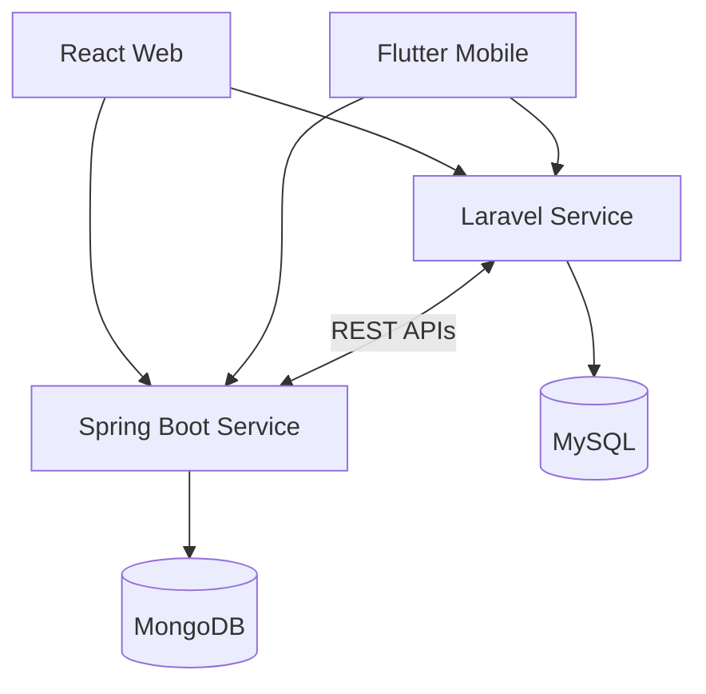

# SkillBridge Architecture & Delivery Phases

## Project Repositories

| Repository | Description |
|------------|-------------|
| Backend (Laravel) | https://github.com/abdallahsobhymahmdod-cpu/skillbridge-backend-laravel |
| Frontend (React) | https://github.com/abdallahsobhymahmdod-cpu/skillbridge-frontend |
| Mobile (Flutter) | https://github.com/abdallahsobhymahmdod-cpu/skillbridge-app |

---

## System Landscape

SkillBridge is built as a distributed multi-service platform.

| Component           | Responsibility                                                       |
| ------------------- | -------------------------------------------------------------------- |
| React Web           | Web client application                                               |
| Flutter Mobile      | Mobile client application                                            |
| Laravel Service     | Core business logic, administration, matching, mentoring workflows   |
| Spring Boot Service | Real-time communication, chat, notifications, collaboration services |
| MySQL               | Relational business data                                             |
| MongoDB             | Conversations, notifications, activity streams                       |
| REST APIs           | Inter-service communication                                          |
| Swagger/OpenAPI     | Service contracts and API documentation                              |
| Jira                | Sprint planning and delivery tracking                                |
| UI/UX               | User experience design and prototyping                               |

---

# Phase 0 — Platform Foundation

Goal: Establish communication between services and secure user management.

## Epic 0.1 — Authentication

| Item           | Acceptance Criteria                                 |
| -------------- | --------------------------------------------------- |
| Authentication | Login and registration available across all clients |
| JWT Security   | Shared authentication strategy across services      |
| Authorization  | User, Mentor, Admin roles supported                 |

## Epic 0.2 — Service Integration

| Item                           | Acceptance Criteria                              |
| ------------------------------ | ------------------------------------------------ |
| Laravel ↔ Spring Communication | REST APIs available and documented               |
| API Contracts                  | Swagger documentation published for all services |
| Error Handling                 | Standardized response structure implemented      |

UI Slice:

* Authentication screens
* User onboarding

---

# Phase 1 — Skills & Matching

Goal: Connect users through intelligent skill discovery.

## Epic 1.1 — Skill Management

| Item               | Acceptance Criteria                          |
| ------------------ | -------------------------------------------- |
| Skill CRUD         | Users manage offered and requested skills    |
| Search & Filtering | Skills discoverable through advanced filters |

## Epic 1.2 — Match Engine

| Item                | Acceptance Criteria                       |
| ------------------- | ----------------------------------------- |
| Recommendations     | Suggested matches generated automatically |
| Ranking Integration | Higher-rated users prioritized            |

UI Slice:

* Skill explorer
* Match recommendation dashboard

---

# Phase 2 — Learning Sessions

Goal: Enable structured mentor-student interactions.

## Epic 2.1 — Session Lifecycle

| Item             | Acceptance Criteria                         |
| ---------------- | ------------------------------------------- |
| Session Creation | Users can schedule sessions                 |
| Session Tracking | Pending, Active, Completed states supported |

## Epic 2.2 — Mentor Workspace

| Item               | Acceptance Criteria              |
| ------------------ | -------------------------------- |
| Student Management | Mentors can manage student lists |
| Progress Tracking  | Session history available        |

UI Slice:

* Mentor dashboard
* Session management views

---

# Phase 3 — Real-Time Collaboration

Goal: Deliver interactive communication capabilities.

## Epic 3.1 — Chat Service

| Item                | Acceptance Criteria                    |
| ------------------- | -------------------------------------- |
| Real-Time Messaging | Instant communication supported        |
| Message Persistence | Conversation history stored in MongoDB |
| Synchronization     | Mobile and Web remain synchronized     |

## Epic 3.2 — Notifications

| Item                | Acceptance Criteria                                |
| ------------------- | -------------------------------------------------- |
| Event Notifications | Matches, sessions, messages generate notifications |
| Read Status         | Notification lifecycle tracked                     |
| Persistence         | Notifications stored and retrievable               |

## Epic 3.3 — Screen Sharing

| Item                  | Acceptance Criteria                        |
| --------------------- | ------------------------------------------ |
| Session Collaboration | Participants share screens during sessions |
| Access Control        | Session owner controls permissions         |
| Live Streaming        | Real-time screen updates delivered         |

UI Slice:

* Chat interface
* Notification center
* Session collaboration tools

---

# Phase 4 — Community & Reputation

Goal: Build trust and accountability.

## Epic 4.1 — Ranking System

| Item         | Acceptance Criteria             |
| ------------ | ------------------------------- |
| Ratings      | Users rate learning experiences |
| Leaderboards | Rankings generated dynamically  |

## Epic 4.2 — Reports

| Item            | Acceptance Criteria           |
| --------------- | ----------------------------- |
| User Reports    | Community reporting available |
| Report Tracking | Resolution workflow supported |

UI Slice:

* Ranking dashboard
* Reporting interface

---

# Phase 5 — Administration

Goal: Provide operational visibility and moderation.

## Epic 5.1 — User Management

| Item            | Acceptance Criteria                    |
| --------------- | -------------------------------------- |
| Active Users    | Logged users visible to administrators |
| User Moderation | Block and unblock actions available    |

## Epic 5.2 — Trust & Safety

| Item              | Acceptance Criteria             |
| ----------------- | ------------------------------- |
| Reports Review    | Admin review workflow available |
| Rating Moderation | Negative ratings can be removed |

UI Slice:

* Admin console
* Moderation center

---

# Dependency Overview

---

# Service Traceability

| Domain         | Laravel | Spring Boot | React | Flutter |
| -------------- | ------- | ----------- | ----- | ------- |
| Auth           | ✓       | ✓           | ✓     | ✓       |
| Skills         | ✓       |             | ✓     | ✓       |
| Matching       | ✓       |             | ✓     | ✓       |
| Sessions       | ✓       |             | ✓     | ✓       |
| Chat           |         | ✓           | ✓     | ✓       |
| Notifications  |         | ✓           | ✓     | ✓       |
| Screen Sharing |         | ✓           | ✓     | ✓       |
| Ranking        | ✓       |             | ✓     | ✓       |
| Reports        | ✓       |             | ✓     | ✓       |
| Payments       | ✓       |             | ✓     | ✓       |
| Admin          | ✓       |             | ✓     |         |
