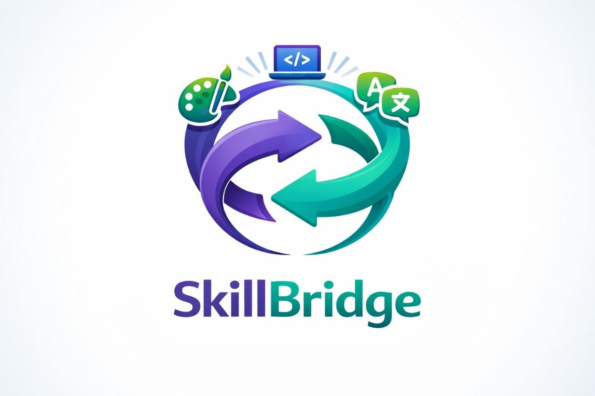
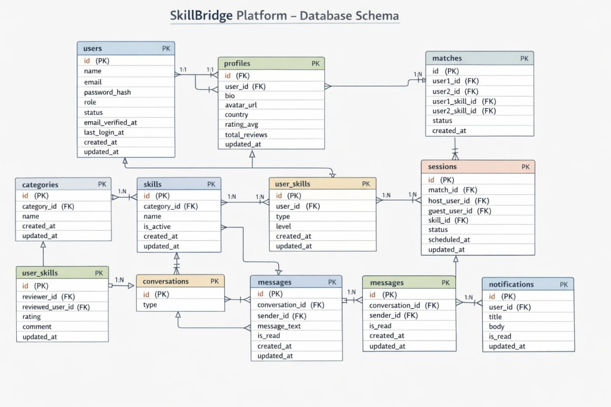

# 🚀 SkillBridge

  

A full-stack platform that connects people through **skill exchange** — learn, teach, and collaborate through smart matching, real-time chat, and interactive sessions.

---

## 🧩 System Architecture

SkillBridge is built with a scalable multi-backend architecture:

- 🎨 **Frontend:** React.js
- 🔵 **Backend A:** Laravel (Core System & Admin Logic)
- 🟢 **Backend B:** Spring Boot (User Interaction & Real-Time Features)

---

## 🔗 Repositories

- 🔵 Core Backend (Laravel)  
  👉 https://github.com/abdallahsobhymahmdod-cpu/skillbridge-backend-laravel

- 🎨 Frontend (React)  
  👉 https://github.com/ahmedsameh-0/skillbridge-frontend-react

---

## ✨ Features

### 🔐 Authentication & Users
- Register & Login
- User Profiles & Reviews
- Block / Unblock Users

---

### 🧠 Skills System
- Full CRUD for Skills
- Explore, Search & Filter Skills

---

### 🤝 Matching
- Suggested Matches
- Match Details
- Smart Pairing

---

### 🗓️ Sessions
- Pending / Active / Completed Sessions
- Session Tracking

---

### 💬 Chat
- Conversations
- Real-time Messaging

---

### 📊 Dashboard
- Total Users
- Active Sessions
- Daily Matches

---

### 🏆 Leaderboard
- Top Rated Users
- Most Active Users
- Top Skills

---

### 📜 Activity Log
- Track User Actions

---

### ⚙️ Settings
- Profile Management
- Password Control

---

## 🗄️ Database Schema

  

---

## 🛠️ Tech Stack

- **Frontend:** React.js
- **Backend:** Laravel + Spring Boot
- **API:** RESTful APIs
- **Database:** MySQL

---

## 💡 Overview

SkillBridge focuses on **scalability** and **clean architecture** by separating core logic from user interaction services, making it easier to extend features like chat and live sessions.

---

## 🚀 Future Improvements

- WebSocket Optimization
- Video Call Integration
- AI-based Match Suggestions  